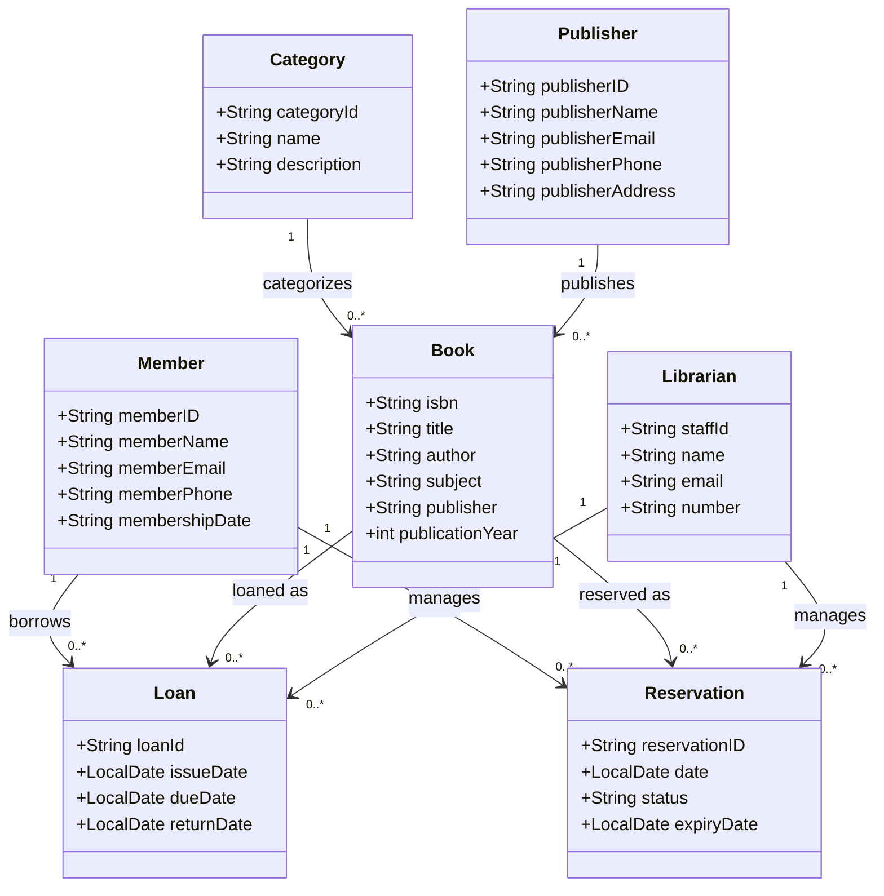

# 3rd Year AppDev Library System

## Group Members
- Leader: 1: TIYANI NGWANA      231266731 - Category and Publisher Entity
- Member 2: ABULELE NTWANAMBI 218276400 - Reservation Entity
- Member 3: NOMHLE NJENGELE   216227488 - Book Entity
- Member 4: OWENKOSI NXASANA  230240887 - Member Entity
- Member 5: SINAZO NTSIMBI    222765208 - Loan Entity
- Member 6: SINETHEMBA NYIMBINYA 220085870 - Librarian Entity

## Domain
A specialized library for 3rd Year Application Development students at CPUT.
Contains academic books for final year modules.

## Entities
- **Book**: Textbooks available in the library
- **Member**: 3rd year students who can borrow books
- **Loan**: Records of books borrowed
- **Librarian**: Staff who manage the library
- **Category**: Book categories (Software Eng, Database, Project Management, etc.)

 ## Contributing Guidelines
  
 ### **Pull Request Process** 
- Create a branch with your student number
- Implement your feature with tests
- Ensure all tests pass
- Update documentation if needed
- Create a Pull Request to main branch
- Request review from team lead
- Address review comments

 ### **Merge after approval**

- Code Review Checklist
- Follows Builder Pattern
- Includes TDD tests
- Proper package placement
- Author comments included
- No merge conflicts
- All tests passing
- **Category**: Book categories (Software Eng, Mobile, Web, etc.)

## UML Diagram

